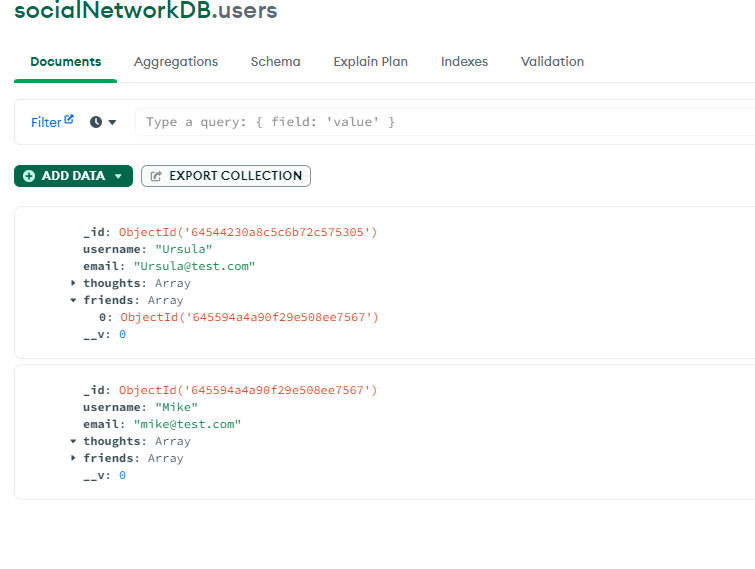

# Social-Network-API

<h1>Social Network API</h1>

    ## Table of Contents
  - [Installation](#installation)
  - [Usage](#Usage)   
  - [License](#License)
    [Video links](#Video)
  - [Github Username](#GitHub Username)
  - [Email Address](#Email)

  []
  https://opensource.org/licenses/MIT

 
 ## Video Links
 Adding a Friend: https://drive.google.com/file/d/1UeIihheoM40kySp9q8NA42qf8QfO4e8t/view

 Add/Updating/Deleting/ a user:https://drive.google.com/file/d/1uHiw9a5bzjlfbe7d0xubEejZ1LyNGPxU/view

 Adding/Deleting a thought: https://drive.google.com/file/d/1a_bj0X5Qlr9ui_zV2tCfO5xXl9TQdw2_/view
 
 
  ## Description
  A way to add friends and post thoughts

 
 
  ## Installation 
MongoDB,Nodejs,Express

## Usage
This will allow users to add friends and post thoughts and reactions to those thoughts.

##License
MIT

## Git Hub Username
faz131

## Email Address:
 

